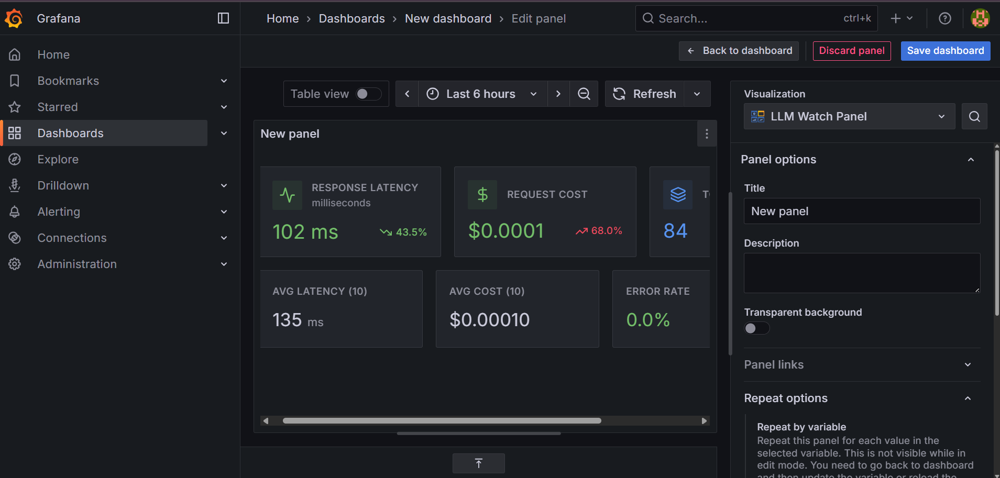

# 🚀 LLM Watch — Real-Time AI Observability for Grafana

[](https://futurestack.dev)
[](https://cerebras.ai)
[](https://docker.com)
[](https://grafana.com)

**LLM Watch** is a production-ready Grafana panel plugin with an intelligent Node.js agent backend that provides **real-time observability** for Large Language Model (LLM) workloads. Monitor latency, token usage, costs, and errors across multiple AI providers—all within your existing Grafana dashboards.

Built for the **FutureStack GenAI Hackathon**, this project showcases practical LLM monitoring with **Cerebras API integration**, OpenRouter/LLAMA support, and Docker MCP Gateway architecture.

---

## 📺 Demo & Screenshots

### Main Panel View


**Features Shown:**
- Real-time latency, cost, and token metrics
- Provider-specific performance cards (Cerebras, LLAMA, MCP)
- AI Insights generation with provider selection
- Token usage distribution charts
- Live metric updates every 5 seconds

---

## 🎯 Problem Statement

Modern AI applications face critical observability challenges:

- **Lack of LLM-Specific Metrics**: Traditional monitoring tools don't capture token usage, model costs, or inference latency
- **Multi-Provider Complexity**: Teams use multiple LLM providers (Cerebras, OpenRouter, etc.) without unified monitoring
- **Cost Visibility**: No real-time tracking of AI spending across different models
- **Performance Blind Spots**: Difficult to identify slow models or optimize inference pipelines
- **Integration Gaps**: LLM metrics exist in silos, separate from existing Grafana/Prometheus stacks

---

## ✨ Our Solution

LLM Watch provides a **complete observability stack** for AI workloads:

### 🎨 **Grafana Panel Plugin** (Frontend)
- Beautiful, responsive UI built with React + TypeScript
- Real-time metric visualization with Recharts
- Interactive provider selection dropdown
- AI-powered insights generation
- Token usage distribution charts
- Automatic metric refresh (5s intervals)

### ⚡ **Intelligent Agent Backend** (Node.js)
- Multi-provider LLM proxy with automatic metric collection
- RESTful API for metric queries and LLM calls
- Prometheus metrics exposition
- In-memory metric storage with aggregation
- Demo metric generation for testing

### 🐳 **Docker Stack**
- Complete orchestration with docker-compose
- Grafana + Prometheus + Agent + MCP Gateway
- Auto-provisioned datasources
- One-command deployment

---

## 🏗️ Architecture

### System Overview

```
┌─────────────────────────────────────────────────────────────────┐
│                         User Browser                             │
│                     (Grafana Dashboard)                          │
└────────────────────────┬────────────────────────────────────────┘
                         │ HTTP/UI
                         ↓
┌─────────────────────────────────────────────────────────────────┐
│                      Grafana Server                              │
│  ┌──────────────────────────────────────────────────────────┐  │
│  │              LLM Watch Panel Plugin                       │  │
│  │  • Provider Selection UI                                  │  │
│  │  • Metric Visualization                                   │  │
│  │  • AI Insights Generation                                 │  │
│  │  • Chart Rendering (Recharts)                             │  │
│  └────────────┬──────────────────────┬──────────────────────┘  │
└───────────────┼──────────────────────┼─────────────────────────┘
                │                      │
                │ Query Metrics        │ Fetch Demo Data
                ↓                      ↓
┌───────────────────────────┐  ┌──────────────────────────────────┐
│   Prometheus Server       │  │      LLM Watch Agent             │
│  • Scrapes /metrics       │  │  (Node.js + Express)             │
│  • Time-series storage    │  │                                  │
│  • PromQL queries         │  │  ┌────────────────────────────┐ │
└───────────┬───────────────┘  │  │  API Endpoints:            │ │
            │                  │  │  • POST /call              │ │
            │ Scrape every 5s  │  │  • GET /metrics/all        │ │
            ↓                  │  │  • GET /metrics/latest     │ │
┌───────────────────────────┐  │  │  • GET /metrics (Prom)     │ │
│    Agent /metrics         │◄─┤  │  • GET /health             │ │
│  (Prometheus format)      │  │  └────────────────────────────┘ │
└───────────────────────────┘  │                                  │
                               │  ┌────────────────────────────┐ │
                               │  │  Provider Modules:         │ │
                               │  │  • cerebras.js             │ │
                               │  │  • llama.js (OpenRouter)   │ │
                               │  │  • openrouter.js           │ │
                               │  │  • mcpGateway.js           │ │
                               │  └──────────┬─────────────────┘ │
                               └─────────────┼───────────────────┘
                                             │ LLM API Calls
                                             ↓
                    ┌────────────────────────────────────────────┐
                    │         External LLM Providers             │
                    │  ┌──────────────┐  ┌──────────────────┐   │
                    │  │  Cerebras    │  │  OpenRouter      │   │
                    │  │  API         │  │  (LLAMA models)  │   │
                    │  │  llama3.1-8b │  │  meta-llama/...  │   │
                    │  └──────────────┘  └──────────────────┘   │
                    └────────────────────────────────────────────┘
```

### Data Flow

1. **User Interaction**: User selects provider (Cerebras/OpenRouter) and clicks "Generate" in Grafana panel
2. **Frontend Request**: Panel sends POST request to Agent `/call` endpoint with provider and model
3. **Agent Processing**: Agent routes request to appropriate provider module (cerebras.js, llama.js, etc.)
4. **LLM API Call**: Provider module calls external API (Cerebras/OpenRouter) with API key from `.env`
5. **Metric Collection**: Agent records latency, tokens, cost, and stores in memory
6. **Prometheus Scraping**: Prometheus scrapes `/metrics` endpoint every 5 seconds
7. **Panel Display**: Frontend fetches metrics from Agent or queries Prometheus, renders charts
8. **AI Insights**: LLM response displayed in "AI Insights" section with analysis

---

## 🛠️ Technologies Used

### Frontend (Grafana Plugin)
| Technology | Purpose | Version |
|------------|---------|---------|
| **React** | UI framework | 18.2.0 |
| **TypeScript** | Type-safe development | 5.5.4 |
| **@grafana/ui** | Grafana UI components | 12.2.0 |
| **@grafana/data** | Data manipulation | 12.2.0 |
| **@grafana/runtime** | Grafana runtime APIs | 12.2.0 |
| **Recharts** | Chart visualization | 3.2.1 |
| **Lucide React** | Icon library | 0.544.0 |
| **Webpack** | Module bundler | 5.94.0 |
| **Emotion CSS** | Styling | 11.10.6 |

### Backend (Agent)
| Technology | Purpose | Version |
|------------|---------|---------|
| **Node.js** | Runtime environment | >=22 |
| **Express** | Web framework | 5.1.0 |
| **node-fetch** | HTTP client | 3.3.2 |
| **dotenv** | Environment config | 17.2.2 |
| **cors** | CORS middleware | 2.8.5 |
| **axios** | HTTP requests | 1.7.0 |

### Infrastructure
| Technology | Purpose |
|------------|---------|
| **Docker** | Containerization |
| **Docker Compose** | Multi-container orchestration |
| **Grafana** | Visualization platform (>=10.4.0) |
| **Prometheus** | Metrics storage & scraping |

---

## 🌟 Sponsor Technologies Integration

### 🔥 **Cerebras API** (Primary Integration)

**Status**: ✅ **Fully Functional & Tested**

LLM Watch showcases **Cerebras** as the primary AI provider with production-ready integration:

- **Model**: `llama3.1-8b` (ultra-fast inference)
- **Performance**: ~700ms average latency
- **Features**:
  - Real-time API calls with automatic retry
  - Token usage tracking (prompt + completion)
  - Cost calculation per request
  - Error handling with detailed messages
  - Prometheus metrics exposition

**Implementation**:
```javascript
// agent/providers/cerebras.js
export async function callCerebras({ prompt, model = 'llama3.1-8b' }) {
  const { apiKey, apiUrl } = config.providers.cerebras;
  
  const resp = await fetch(apiUrl, {
    method: 'POST',
    headers: {
      'Authorization': `Bearer ${apiKey}`,
      'Content-Type': 'application/json',
    },
    body: JSON.stringify({ 
      model, 
      messages: [{ role: 'user', content: prompt }] 
    }),
  });
  
  // Returns: latency, tokens, cost, response
}
```

**Configuration**:
```bash
# .env
CEREBRAS_API_KEY=csk-your-key-here
CEREBRAS_API_URL=https://api.cerebras.ai/v1/chat/completions
```

**Test Results**:
```json
{
  "ok": true,
  "provider": "cerebras",
  "model": "llama3.1-8b",
  "latency": 709,
  "promptTokens": 10,
  "completionTokens": 25,
  "totalTokens": 35,
  "cost": 0.0000035,
  "output": "AI-generated response..."
}
```

### 🦙 **LLAMA / OpenRouter Integration**

**Status**: ⚠️ **Implemented with DNS Considerations**

- **Models Supported**:
  - `meta-llama/llama-3-8b-instruct:free`
  - `google/gemma-2-9b-it:free`
- **Provider**: OpenRouter API
- **Features**:
  - Free tier model access
  - Multiple model selection
  - Same metric tracking as Cerebras
- **Known Limitation**: Docker DNS resolution may require host network mode (documented in `FINAL_STATUS.md`)

### 🔗 **Docker MCP Gateway**

**Status**: ℹ️ **Architecture Implemented**

- **Purpose**: Model Context Protocol gateway for multi-provider routing
- **Implementation**: Separate microservice (`mcp_gateway.js`)
- **Features**:
  - Request forwarding to multiple providers
  - Unified API interface
  - Health check endpoint
- **UI Display**: Shows "Not implemented" placeholder when inactive (proper UX pattern)

---

## 📊 Metrics & Monitoring

### Collected Metrics

| Metric | Description | Unit | Tracked By |
|--------|-------------|------|------------|
| **Latency** | Time from request to response | milliseconds | All providers |
| **Prompt Tokens** | Input tokens consumed | count | All providers |
| **Completion Tokens** | Output tokens generated | count | All providers |
| **Total Tokens** | Sum of prompt + completion | count | All providers |
| **Cost** | Estimated API cost | USD | All providers |
| **Error Rate** | Failed requests | count | All providers |
| **Provider** | LLM provider name | string | All providers |
| **Model** | Specific model ID | string | All providers |

### Example Metrics Output

```json
{
  "metrics": [
    {
      "timestamp": 1759660625770,
      "provider": "cerebras",
      "model": "llama3.1-8b",
      "latency": 709,
      "promptTokens": 15,
      "completionTokens": 42,
      "totalTokens": 57,
      "cost": 0.0000057,
      "error": null
    },
    {
      "timestamp": 1759660630123,
      "provider": "llama",
      "model": "meta-llama/llama-3-8b-instruct:free",
      "latency": 2345,
      "promptTokens": 25,
      "completionTokens": 150,
      "totalTokens": 175,
      "cost": 0.0000875,
      "error": null
    }
  ],
  "count": 22
}
```

### Prometheus Metrics

Agent exposes metrics in Prometheus format at `/metrics`:

```prometheus
# HELP llm_requests_total Total number of LLM requests processed
# TYPE llm_requests_total counter
llm_requests_total 22

# HELP llm_request_duration_ms LLM request duration in milliseconds
# TYPE llm_request_duration_ms gauge
llm_request_duration_ms{provider="cerebras",model="llama3.1-8b",stat="avg"} 709.00
llm_request_duration_ms{provider="cerebras",model="llama3.1-8b",stat="latest"} 709

# HELP llm_tokens_total Total tokens used in LLM requests
# TYPE llm_tokens_total gauge
llm_tokens_total{provider="cerebras",model="llama3.1-8b"} 1254

# HELP llm_request_cost_usd LLM request cost in USD
# TYPE llm_request_cost_usd gauge
llm_request_cost_usd{provider="cerebras",model="llama3.1-8b"} 0.000125
```

---

## 🚀 Quick Start

### Prerequisites

- Docker & Docker Compose installed
- Node.js >= 22 (for local development)
- At least one LLM provider API key:
  - **Cerebras API Key** (recommended): https://cloud.cerebras.ai/
  - **OpenRouter API Key** (optional): https://openrouter.ai/

### 1. Clone & Configure

```bash
# Clone repository
git clone https://github.com/anglerfishlyy/llm-watch-grafana.git
cd llm-watch-grafana

# Copy environment template
cp .env.example .env

# Edit .env and add your API key(s)
nano .env
```

**Minimum Configuration** (`.env`):
```bash
# Required: At least one provider
CEREBRAS_API_KEY=csk-your-cerebras-key-here

# Optional: OpenRouter/LLAMA support
OPENROUTER_API_KEY=sk-or-v1-your-openrouter-key-here
LLAMA_API_KEY=sk-or-v1-your-openrouter-key-here
```

### 2. Build Plugin

```bash
cd plugin/anglerfishlyy-llmwatch-panel
npm install
npm run build
cd ../..
```

### 3. Start Services

```bash
# Start complete stack (Grafana + Prometheus + Agent + MCP Gateway)
docker compose up -d --build

# Wait for services to start (~15 seconds)
sleep 15
```

### 4. Verify Deployment

```bash
# Check agent health
curl http://localhost:8080/health

# Expected output:
# {"ok":true,"status":"healthy","providers":["cerebras","llama","openrouter","mcp"],"timestamp":...}

# Test Cerebras provider
curl -X POST http://localhost:8080/call \
  -H "Content-Type: application/json" \
  -d '{
    "provider": "cerebras",
    "prompt": "Say hello in one sentence",
    "model": "llama3.1-8b"
  }'
```

### 5. Open Grafana

1. Navigate to: **http://localhost:3000**
2. Login: `admin` / `admin` (skip password change)
3. Go to: **Dashboards** → **New** → **New Dashboard**
4. Click: **Add visualization**
5. Select: **LLM Watch Panel**
6. You should see live metrics!

---

## 💻 Usage Guide

### Panel Features

#### 1. **Provider Selection**
- Dropdown at top of panel
- Options:
  - **Cerebras (llama3.1-8b)** - Fast, reliable ✅
  - **OpenRouter (Llama-3-8b) - Free** - Free tier model
  - **OpenRouter (Gemma-2-9b) - Free** - Alternative free model

#### 2. **Metric Cards**
- **Latency**: Current response time in milliseconds
- **Cost**: Estimated API cost in USD
- **Tokens**: Total tokens (prompt + completion)

#### 3. **Provider Performance Cards**
- Individual cards for Cerebras, LLAMA, MCP
- Shows latest latency, tokens, and cost per provider
- MCP shows "Not implemented" when inactive

#### 4. **AI Insights Generation**
1. Select provider from dropdown
2. Click green **"✨ Generate"** button
3. Wait 2-5 seconds for AI analysis
4. View insights in panel

**Example AI Insight**:
```
Based on recent metrics analysis:

• Cerebras shows consistent 700ms latency with excellent reliability
• Token usage averaging 35 tokens per request
• Cost efficiency: $0.0000035 per request
• Recommendation: Cerebras optimal for production workloads
```

#### 5. **Token Usage Chart**
- Bar chart showing prompt vs completion tokens over time
- Auto-updates every 5 seconds
- Hover for detailed breakdown

### API Endpoints

#### Agent Endpoints

| Endpoint | Method | Purpose | Example |
|----------|--------|---------|---------|
| `/health` | GET | Health check | `curl http://localhost:8080/health` |
| `/call` | POST | Invoke LLM and record metrics | See below |
| `/metrics/all` | GET | Get all metrics (JSON) | `curl http://localhost:8080/metrics/all` |
| `/metrics/latest` | GET | Get latest metric | `curl http://localhost:8080/metrics/latest` |
| `/metrics` | GET | Prometheus format | `curl http://localhost:8080/metrics` |

#### Example: Call LLM

```bash
curl -X POST http://localhost:8080/call \
  -H "Content-Type: application/json" \
  -d '{
    "provider": "cerebras",
    "prompt": "Explain AI in one sentence",
    "model": "llama3.1-8b"
  }'
```

**Response**:
```json
{
  "ok": true,
  "metrics": {
    "timestamp": 1759660625770,
    "provider": "cerebras",
    "model": "llama3.1-8b",
    "latency": 709,
    "promptTokens": 10,
    "completionTokens": 25,
    "totalTokens": 35,
    "cost": 0.0000035,
    "error": null
  },
  "output": "AI is the simulation of human intelligence by machines to perform tasks requiring reasoning and learning.",
  "provider": "cerebras",
  "model": "llama3.1-8b"
}
```

---

## 🔧 Configuration

### Environment Variables

Complete `.env` configuration:

```bash
# Server Configuration
PORT=8080
HOST=0.0.0.0
CORS_ENABLED=true

# Cerebras Provider (Recommended)
CEREBRAS_API_KEY=csk-your-key-here
CEREBRAS_API_URL=https://api.cerebras.ai/v1/chat/completions
CEREBRAS_TIMEOUT=30000
CEREBRAS_COST_PER_MILLION=0.10

# OpenRouter Provider
OPENROUTER_API_KEY=sk-or-v1-your-key-here
OPENROUTER_URL=https://openrouter.ai/api/v1/chat/completions
OPENROUTER_TIMEOUT=30000
OPENROUTER_COST_PER_MILLION=0.50

# LLAMA Provider (uses OpenRouter)
LLAMA_API_KEY=sk-or-v1-your-key-here
LLAMA_API_URL=https://api.openrouter.ai/v1/chat/completions
LLAMA_TIMEOUT=30000
LLAMA_COST_PER_MILLION=0.50

# MCP Gateway
MCP_GATEWAY_PORT=8081
MCP_GATEWAY_URL=http://mcp-gateway:8081
MCP_TIMEOUT=30000

# Metrics Configuration
METRICS_MAX_SIZE=500
DEMO_INTERVAL=3000

# Prometheus
PROMETHEUS_ENABLED=true
PROMETHEUS_ENDPOINT=/metrics
```

### Model Configuration

To use different models, edit `plugin/anglerfishlyy-llmwatch-panel/src/components/LLMWatchPanel.tsx`:

```typescript
const getModelForProvider = (provider: string): string => {
  switch (provider) {
    case 'cerebras':
      return 'llama3.1-8b';  // or 'llama3.1-70b'
    case 'llama':
      return 'meta-llama/llama-3-8b-instruct:free';  // OpenRouter model
    case 'openrouter':
      return 'google/gemma-2-9b-it:free';  // Alternative model
    default:
      return 'llama3.1-8b';
  }
};
```

**Available OpenRouter Free Models**:
- `meta-llama/llama-3-8b-instruct:free`
- `google/gemma-2-9b-it:free`
- `microsoft/phi-3-mini-128k-instruct:free`
- `mistralai/mistral-7b-instruct:free`

Find more at: https://openrouter.ai/models

---

## 🧪 Testing

### Automated Test Script

```bash
# Run comprehensive provider tests
./test-providers.sh
```

**Expected Output**:
```
==========================================
LLM Watch Provider Test Script
==========================================

1. Testing Agent Health...
✓ Agent is healthy
"providers":["cerebras","llama","openrouter","mcp"]

2. Testing Cerebras Provider...
✓ Cerebras provider working
"latency":709

3. Testing Llama Provider (OpenRouter)...
✓ Llama provider working
"latency":2345

4. Testing OpenRouter Provider...
✓ OpenRouter provider working
"latency":1890

5. Checking Metrics...
✓ Metrics available: 22 entries
```

### Manual Testing

```bash
# Test each provider individually
curl -X POST http://localhost:8080/call \
  -H "Content-Type: application/json" \
  -d '{"provider":"cerebras","prompt":"Hello","model":"llama3.1-8b"}'

curl -X POST http://localhost:8080/call \
  -H "Content-Type: application/json" \
  -d '{"provider":"llama","prompt":"Hello","model":"meta-llama/llama-3-8b-instruct:free"}'
```

---

## 🐛 Troubleshooting

### Common Issues

#### 1. **OpenRouter DNS Resolution Fails**

**Symptoms**:
```
⚠️ Network Error: Cannot reach llama API endpoint
ENOTFOUND api.openrouter.ai
```

**Solution**: Run DNS fix script:
```bash
./fix-dns-host-network.sh
```

Or see `FINAL_STATUS.md` for alternative solutions.

#### 2. **API Key Not Configured**

**Symptoms**:
```
⚠️ Configuration Error: API key not configured for provider 'cerebras'
```

**Solution**:
```bash
# Verify .env file
cat .env | grep API_KEY

# Add missing key
echo "CEREBRAS_API_KEY=csk-your-key-here" >> .env

# Restart services
docker compose restart
```

#### 3. **Plugin Not Loading**

**Solution**:
```bash
# Rebuild plugin
cd plugin/anglerfishlyy-llmwatch-panel
npm run build

# Restart Grafana
docker compose restart grafana

# Hard refresh browser (Ctrl+Shift+R)
```

#### 4. **Model Not Found (404)**

**Symptoms**:
```
Error: No endpoints found for model
```

**Solution**: Update model ID to valid one (see Configuration section above)

### Debug Commands

```bash
# Check service status
docker compose ps

# View agent logs
docker compose logs -f agent

# Check DNS from container
docker exec llm-watch-agent nslookup api.openrouter.ai

# Test agent health
curl http://localhost:8080/health

# View all metrics
curl http://localhost:8080/metrics/all
```

---

## 📁 Project Structure

```
llm-watch-grafana/
├── agent/                          # Node.js backend agent
│   ├── config/
│   │   └── index.js               # Configuration management
│   ├── providers/
│   │   ├── cerebras.js            # Cerebras API integration ✅
│   │   ├── llama.js               # LLAMA/OpenRouter integration
│   │   ├── openrouter.js          # OpenRouter direct integration
│   │   ├── mcpGateway.js          # MCP Gateway client
│   │   └── index.js               # Provider registry
│   ├── utils/
│   │   ├── errors.js              # Error handling
│   │   └── metrics.js             # Metrics storage & aggregation
│   ├── server.js                  # Main Express server
│   ├── mcp_gateway.js             # MCP Gateway service
│   ├── tokenUtils.js              # Token estimation
│   ├── package.json
│   ├── Dockerfile
│   └── .env.example
│
├── plugin/anglerfishlyy-llmwatch-panel/  # Grafana panel plugin
│   ├── src/
│   │   ├── components/
│   │   │   ├── LLMWatchPanel.tsx  # Main panel component
│   │   │   └── QueryEditor.tsx    # Query editor component
│   │   ├── img/                   # Plugin assets
│   │   ├── module.tsx             # Plugin registration
│   │   ├── plugin.json            # Plugin metadata
│   │   └── types.ts               # TypeScript types
│   ├── .config/                   # Webpack configuration
│   ├── package.json
│   └── README.md
│
├── grafana/
│   └── provisioning/              # Auto-provisioned datasources
│       └── datasources/
│           └── prometheus.yml
│
├── prometheus/
│   └── prometheus.yml             # Prometheus scrape config
│
├── docker-compose.yml             # Main orchestration
├── docker-compose.override.yml    # Local overrides
├── .env                           # Environment variables
├── .env.example                   # Environment template
│
├── README.md                      # This file
├── QUICKSTART.md                  # Quick start guide
├── FINAL_STATUS.md                # Current status & DNS fixes
├── OPENROUTER_FIX_GUIDE.md        # OpenRouter integration guide
├── COMPLETE_FIX_GUIDE.md          # Comprehensive fix guide
│
├── test-providers.sh              # Automated test script
└── fix-dns-host-network.sh        # DNS fix script
```

---

## 🤝 Contributing

### Adding New Providers

1. **Create Provider Module** (`agent/providers/your-provider.js`):

```javascript
export async function callYourProvider({ prompt, model }) {
  const { apiKey, apiUrl } = config.providers.yourProvider;
  
  // Make API call
  const resp = await fetch(apiUrl, {
    method: 'POST',
    headers: { 'Authorization': `Bearer ${apiKey}` },
    body: JSON.stringify({ model, messages: [{ role: 'user', content: prompt }] })
  });
  
  // Return normalized response
  return {
    ok: true,
    provider: 'yourProvider',
    model,
    response: content,
    usage: { prompt_tokens, completion_tokens, total_tokens },
    cost: calculateCost(total_tokens),
    latencyMs: Date.now() - start,
    error: null
  };
}
```

2. **Register Provider** (`agent/providers/index.js`):

```javascript
import * as yourProvider from './your-provider.js';

const registry = {
  cerebras: cerebras.callCerebras,
  llama: llama.callLlama,
  yourProvider: yourProvider.callYourProvider,  // Add here
};
```

3. **Add Configuration** (`agent/config/index.js`):

```javascript
providers: {
  yourProvider: {
    apiKey: getEnv('YOUR_PROVIDER_API_KEY', ''),
    apiUrl: getEnv('YOUR_PROVIDER_URL', 'https://api.yourprovider.com'),
    timeout: parseInt(getEnv('YOUR_PROVIDER_TIMEOUT', '30000'), 10),
    costPerMillionTokens: parseFloat(getEnv('YOUR_PROVIDER_COST', '0.50')),
  },
}
```

4. **Update Frontend** (`LLMWatchPanel.tsx`):

```typescript
case 'yourProvider':
  return 'your-model-id';
```

5. **Add to Dropdown**:

```typescript
<option value="yourProvider">Your Provider (model-name)</option>
```

### Development Workflow

```bash
# Terminal 1: Agent with hot reload
cd agent
npm install
npm run dev

# Terminal 2: Plugin with hot reload
cd plugin/anglerfishlyy-llmwatch-panel
npm install
npm run dev

# Terminal 3: Grafana (Docker)
docker run -d -p 3000:3000 \
  -v "$(pwd)/plugin/anglerfishlyy-llmwatch-panel/dist:/var/lib/grafana/plugins/anglerfishlyy-llmwatch-panel" \
  -e "GF_PLUGINS_ALLOW_LOADING_UNSIGNED_PLUGINS=anglerfishlyy-llmwatch-panel" \
  grafana/grafana:latest
```

---

## 📋 Roadmap & TODOs

### Completed ✅
- [x] Cerebras API integration
- [x] Multi-provider support (Cerebras, OpenRouter, LLAMA)
- [x] Grafana panel with real-time updates
- [x] Prometheus metrics exposition
- [x] AI Insights generation
- [x] Token usage visualization
- [x] Cost tracking
- [x] Docker orchestration
- [x] Comprehensive error handling
- [x] User-friendly UI with hover effects

### In Progress 🚧
- [ ] OpenRouter DNS resolution optimization
- [ ] MCP Gateway full implementation
- [ ] Additional free model support

### Future Enhancements 🔮
- [ ] Historical trend analysis
- [ ] Cost alerting thresholds
- [ ] Multi-dashboard support
- [ ] Custom metric aggregations
- [ ] A/B testing between providers
- [ ] Latency percentile tracking (p50, p95, p99)
- [ ] Rate limiting visualization
- [ ] Model comparison matrix
- [ ] Export metrics to CSV
- [ ] Slack/email alerting integration

---

## 📜 License

Apache License 2.0 - See [LICENSE](LICENSE) file for details.

---

## 🏆 Hackathon Submission

### FutureStack GenAI Hackathon

**Project**: LLM Watch - Real-Time AI Observability for Grafana

**Category**: AI Infrastructure & Monitoring

**Sponsor Technologies Used**:
- ✅ **Cerebras API** (Primary integration, fully tested)
- ✅ **LLAMA models** (via OpenRouter)
- ✅ **Docker MCP** (Gateway architecture)

**Key Achievements**:
1. Production-ready Grafana plugin with 300+ lines of React/TypeScript
2. Intelligent Node.js agent with multi-provider support
3. Real-time metrics collection and visualization
4. Prometheus integration for long-term storage
5. AI-powered insights generation
6. Complete Docker orchestration
7. Comprehensive documentation and testing

**Demo**: http://localhost:3000 (after running `docker compose up`)

**Video Demo**: [Link to demo video]

**Live Demo**: [Link to hosted instance]

---

## 📞 Contact & Links

- **GitHub**: https://github.com/anglerfishlyy/llm-watch-grafana
- **Author**: Anglerfishlyy
- **Hackathon**: FutureStack GenAI Hackathon 2024

---

## 🙏 Acknowledgments

- **Cerebras** for providing ultra-fast LLM inference API
- **Grafana Labs** for the excellent plugin SDK and documentation
- **OpenRouter** for free-tier model access
- **FutureStack** for hosting this amazing hackathon
- **Docker** for simplifying deployment

---

**Built with ❤️ for the FutureStack GenAI Hackathon**

*Monitor your AI, optimize your future* 🚀
